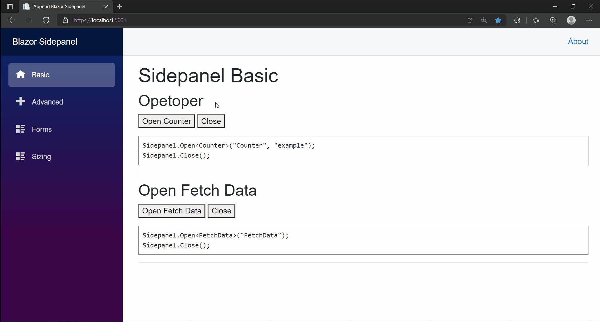

# Sidepanel

[](https://www.nuget.org/packages/Append.Blazor.Sidepanel)
[](https://www.nuget.org/packages/Append.Blazor.Sidepanel)
[](https://github.com/Append-IT/Blazor.Sidepanel/blob/main/LICENSE)

## Preview


## Installation

```
Install-Package Append.Blazor.Sidepanel
```

## Demo
There is a sample application in /docs folder which is also hosted as [documentation](https://blazor-sidepanel.append.be). 

## Usage

### Add `ISidepanelService` via DI in `Program.cs`
```csharp
builder.Services.AddSidepanel();
```

### Add to `_Imports.razor`
```cs
@using Append.Blazor.Sidepanel
```

### Add to `MainLayout.razor`
```cs
<Sidepanel/>
```

### Inject into component/pages
```cs
@inject ISidepanelService Sidepanel
```

### Opening and Closing
#### Basic
```csharp
Sidepanel.Open<Counter>("Counter", "example");
Sidepanel.Close();
```

#### Advanced with 1 parameter
> The parameter has to be set in the Counter component

```cs
private int increaseBy = 10;
private void OpenCounterWithParameter()
{
    Sidepanel.Open<Counter>("Counter", "example", (nameof(increaseBy),increaseBy));
}
```

#### Advanced with multiple parameters
> The parameters have to be set in the Counter component
```cs
private void OpenCounterWithParameters()
{
    var parameters = new Dictionary<string, object> { 
        { (nameof(increaseBy)), increaseBy },
        { (nameof(initialValue)), initialValue}
    };
    Sidepanel.Open<Counter>("Counter","Example",parameters);
}
```

#### Override styling
In App.css
```css
#sidepanel.is-open {
    width: 80%;
}

@@media (min-width: 768px) {
    #sidepanel.is-open {
        width: 50%;
    }
}
```


# Contributions and feedback

Please feel free to use the component, open issues, fix bugs or provide feedback.

# Contributors

This project is created and maintained by:

- [Benjamin Vertonghen](https://github.com/vertonghenb)
